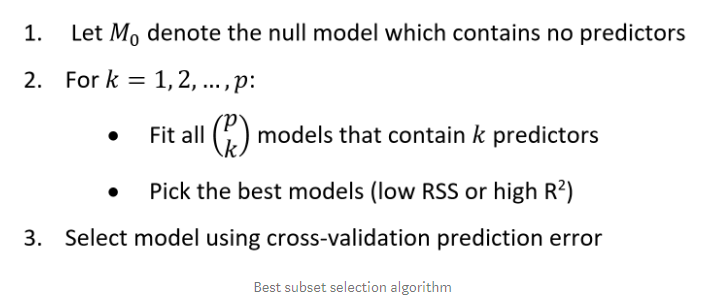
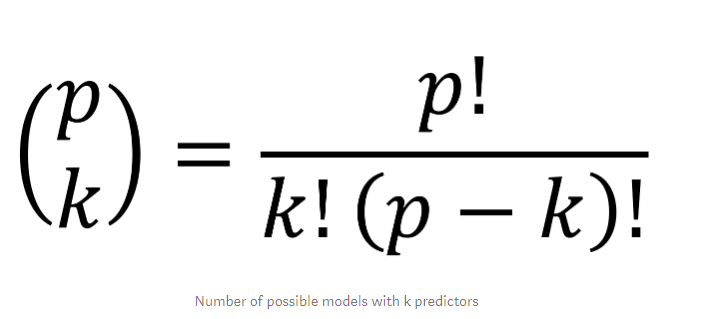
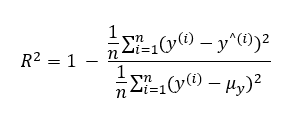
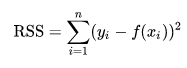
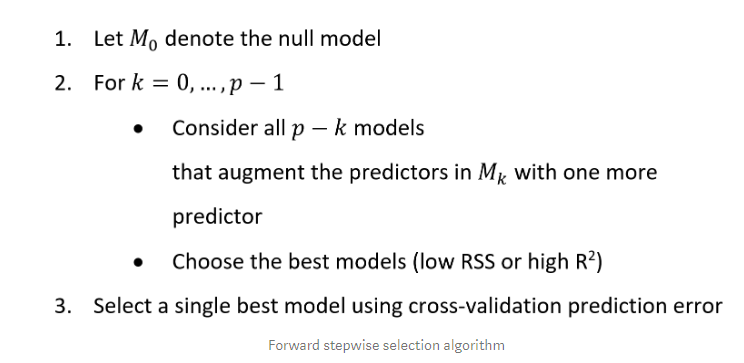
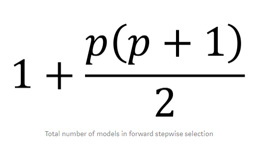
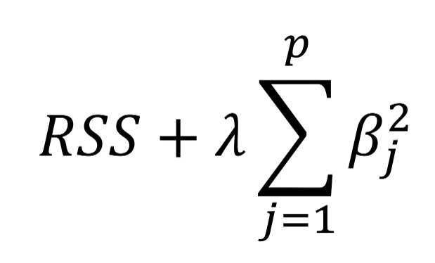
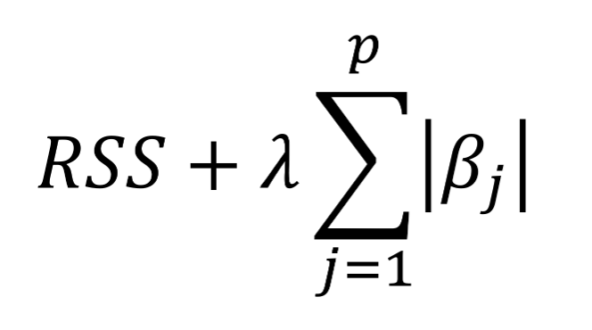
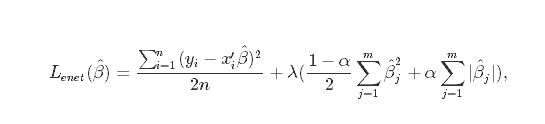

## LinearRegerssion

#### 선형모형을 선택하는 방법

최소제곱법을 사용하는 방법은 대부분 작동하지만 실패하는 상황이 있다.

예를들면, 관측해야할 값보다 예측 변수가 더 많을 경우 분산이 무한하므로 최소제곱법을 사용할 수 없다.

예측변수가 많을때 영향력이 적은 변수들이 추가되고 이는 모델의 복잡도를 증가시킨다. 그래서 우리는 관련성이 높은 변수만 포함하는 방법을 선택해야한다.

#### Subset selection

R2

RSS

변수의 하위 집합을 선택하고 모든 조합을 시도하여 일부 기준을 최소화하는 것을 선택합니다.

그래서 예측변수가 많을수록 계산이 오래걸린다. 예를 들어 40개의 변수가 있다면 1조개의 모델을 탐색해야 한다.

#### Stepwise selection

forword stepwise 와 backward stepwise 방식이 존재한다

- forword : 예측변수가 없을때 부터 시작해 하나씩 추가해나가면서 적합도가 큰 변수를 모델에 추가해나간다.

- backword : 모든 예측변수를 모형에 넣고 RSS를 늘리지 않거나 R2값을 줄이지 않으면 하나씩 변수를 제거해나간다. 이 방법은 예측변수가 관측치보다 많을때만 가능하다.

이전 방법과는 달리 40개의 변수가 있을때 821개의 모델만 탐색하면 된다.

#### Shrinkage methods(축소)

ridge and lasso regression 

**Ridge regression**

전통적인 리니어 피팅은 RSS 최소화를 포함한다. 리지는 새로운 변수를 더하고 그 변수를 최소화 시킨다.

Lamda(하이퍼 파라미터 값이 클 수록 0 에 가까워진다)는 투닝 매개 변수

람다는 테스트 에러를 최소화시키기 위해 교차검즘을 사용하여 찾는다. 최적의 람다 범위를 찾아 테스트오류를 최소화 할 수 있다.

> 교차검증이란 두 데이터 집합 모두 종속 변수값(Y값)이 있어야 하며, 테스트와 트레인 셋을 나누어 트레인 셋으로 모델을 만들고 테스트 셋으로 성능을 검사하는 것이다.

Ridge regression은 모든 예측변수가 포함되어 모델의 적합도를 높일땐 좋지만 변수 선택을 할 수 없다.

그래서 대부분의 예측 변수가 반응에 영향을 줄때 더 잘 동작합니다.

**Lasso**

아래 수식을 최소화 시키는게 목적이다. 제곱대신 절대값을 사용한다.

여기서 Ridge와 다른 점은 람다가 클때 일부 계수는 사실상 0이 된다. 그래서 변수 선택을 수행할 수 있고 모델을 훨씬 쉽게 해석할 수 있다. Ridge 와 반대로 예측 변수의 반응이 0에 가까울때 더 잘 동작한다. 그리고 데이터 의존성이 너무크다.

**Elastice Net**

Ridge와 Lasso의 단점을 보안하고자 만들어 졌고, 두가지 방식을 혼합하여 사용한다.

여기서 알파는 람다의 혼합 매개 변수이다. cross-validation을 이용해 하이퍼 파라미터를 조정하여 최상의 알파값을 선택할 수 있다.