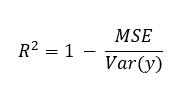

## LinearRegerssion

#### 선형모형을 선택하는 방법

최소제곱법을 사용하는 방법은 대부분 작동하지만 실패하는 상황이 있다.

예를들면, 관측해야할 값보다 예측 변수가 더 많을 경우 분산이 무한하므로 최소제곱법을 사용할 수 없다.

예측변수가 많을때 영향력이 적은 변수들이 추가되고 이는 모델의 복잡도를 증가시킨다. 그래서 우리는 관련성이 높은 변수만 포함하는 방법을 선택해야한다.

#### Subset selection

R2

RSS

예측변수가 많을수록 계산이 오래걸린다. 

예를 들어 40개의 변수가 있다면 1조개의 모델을 탐색해야 한다.

#### Stepwise selection

forword stepwise 와 backward stepwise 방식이 존재한다

- forword : 예측변수가 없을때 부터 시작해 하나씩 추가해나가면서 적합도가 큰 변수를 모델에 추가해나간다.

- backword : 모든 예측변수를 모형에 넣고 RSS를 늘리지 않거나 R2값을 줄이지 않으면 하나씩 변수를 제거해나간다. 이 방법은 예측변수가 관측치보다 많을때만 가능하다.

이전 방법과는 달리 40개의 변수가 있을때 821개의 모델만 탐색하면 된다.

#### Shrinkage methods(축소)

