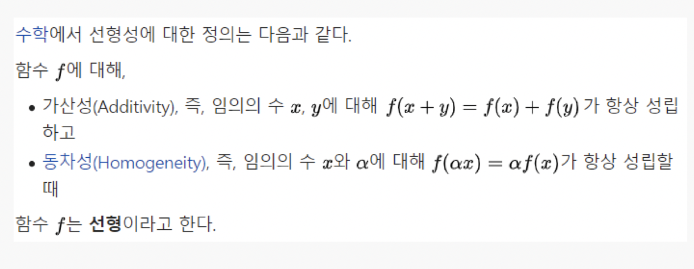
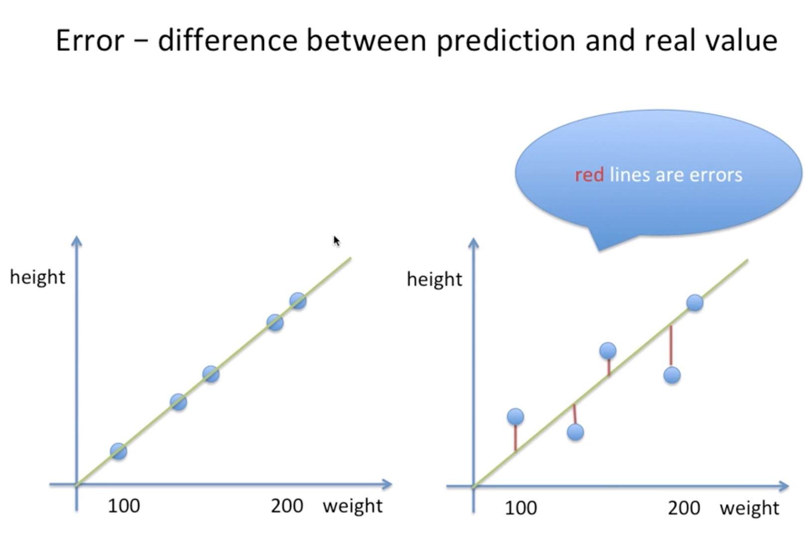
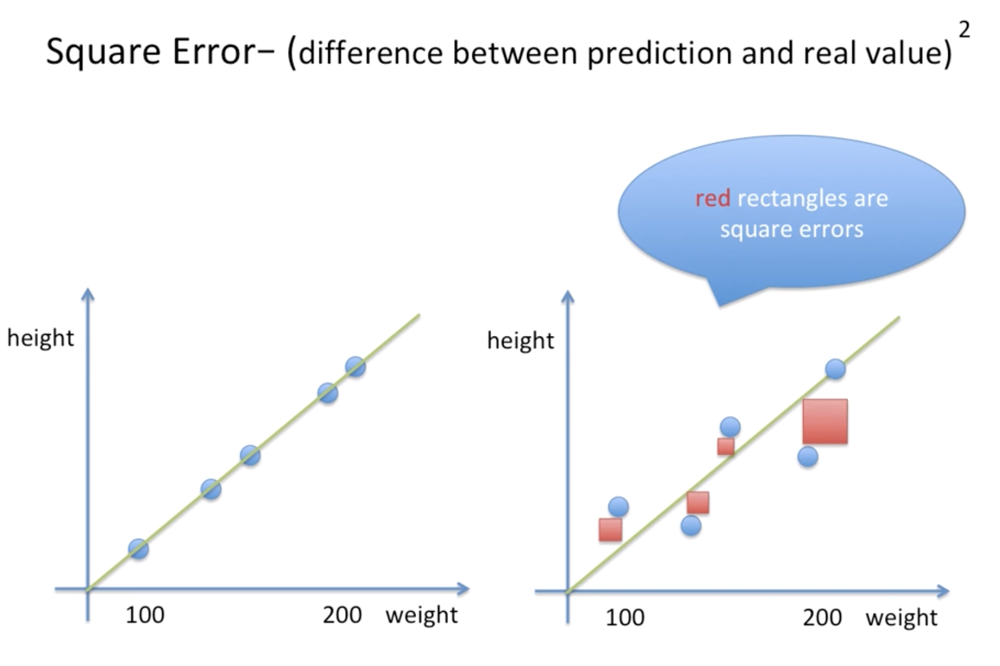
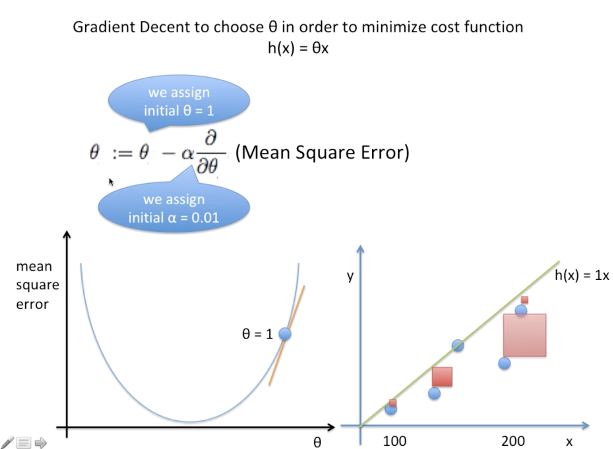
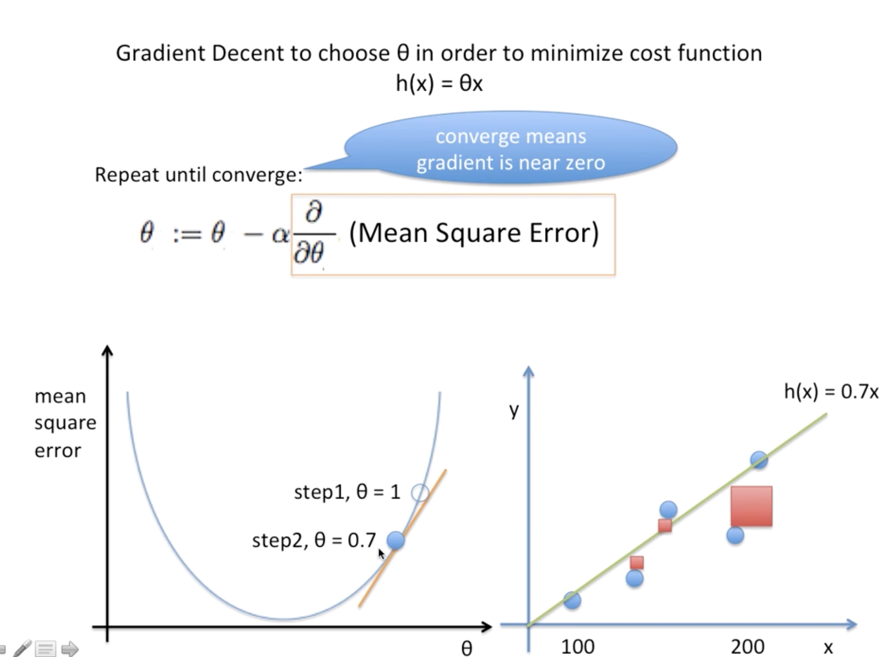
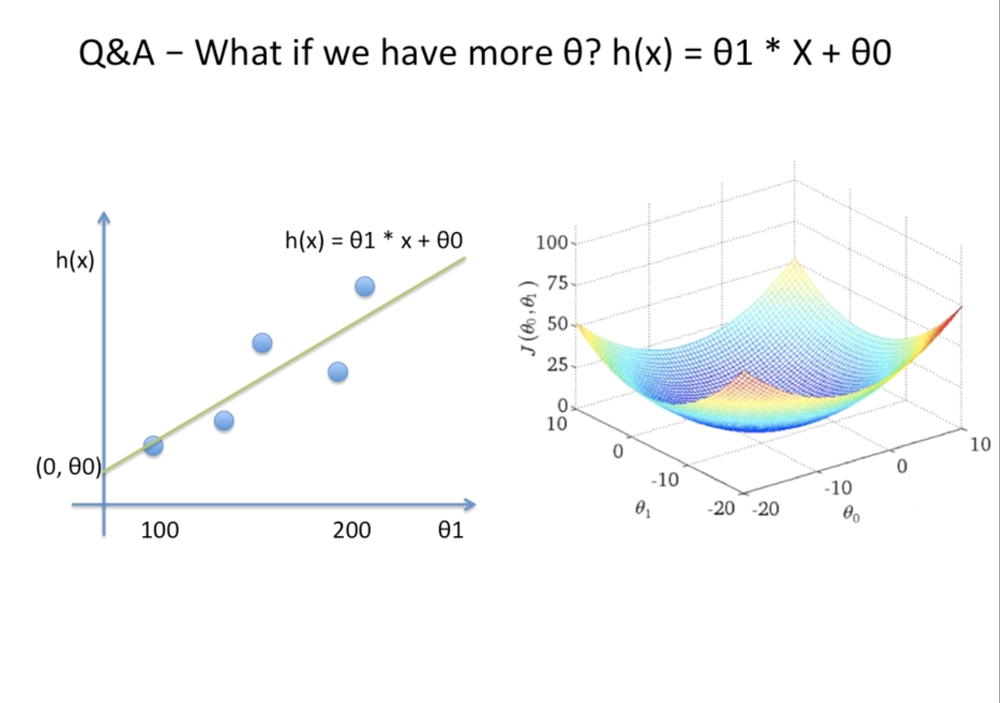

# Linear regression

> 선형 회귀는 예측과 훈련 세트에 있는 타깃 y 사이의 **평균제곱오차**mean squared error를 최소화하는 파라미터 w(weight)와 b(bias)를 찾습니다. 평균제곱오차는 예측값과 타깃값의 차이를 제곱하여 더한 후에 샘플의 개수로 나눈 것입니다. 

## Linear?

선형회귀에 알아보기앞서 선형이란 무엇인가? 우리가 일반적으로 알고있는 선형과 선형대수학에서의 선형은 크게 다르다.

## Linear Regression?

직선, 즉 일차함수의 개념인 y = ax + b 직선을 임의로 그려놓고, 그직선을 바탕으로 예측하는 것.

예측을 하기위해선 어떻게 해야할까 ? 예측값의 오차를 줄여아한다 !

선형회귀를 모델링할땐 square error 라는 방법을 사용한다 

**square error**를 사용하는 이유

1. 우리 눈에 보이기 쉽다.
2. 에러의 값이 작을때, 값이 증폭되어 비교에 용이하다
3. Gradient Descent의 Backpropagation 개념에 계산이 용이하게 편미분된다.

## Linear Regression Goal

그럼 이제 우리가 원하는 가장 예측값의 오차가 적은 모델을 만드려면 어떻게 해야할까?

**Cost Function** (실제 값과 가설값의 차이) 을 최저로 만드는것

선형회귀모델에서 Cost Function -> Mean Square error = 1/n*∑(h(x)-y)²

Cost Function을 구하기 위해 사용되는 개념은 **LMS**(최소제곱법)와 **Backpropagation**을 사용한다.

참교 자료 

https://roboticist.tistory.com/537 - 최소제곱법

https://developers.google.com/machine-learning/crash-course/descending-into-ml/video-lecture?hl=ko - 선형회귀

https://www.youtube.com/watch?v=MwadQ74iE-k - 선형회귀

https://m.blog.naver.com/PostView.nhn?blogId=gosunwoo97&logNo=221074463296&proxyReferer=https%3A%2F%2Fwww.google.com%2F - 선형성

https://brunch.co.kr/@gimmesilver/18 - 선형회귀모델에서 선형이란