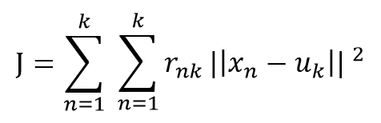

### K-means Clustering

클러스터는 특정 유사성으로 인해 함께 집계 된 데이터 요소 모음을 나타냅니다.

비지도 학습으로 K개의 Clustering을 목적으로 사용된다. 각 군집은 하나의 중심을 가지고 각 개체는 가 장 가까운 중심으로 할당된다. (K 는 하이퍼파라미터이다.) 데이터가 유클리디안 공간위에 있어야한다. (평균을 구할 수 있도록, 실수의 좌표를 가져야한다.)

K-means는 EM 알고리즘을 기반으로 작동한다. 이는 Expectations과 Maximization이며 이를 수렴할 때까지 반복된다.

- Expectations : 각 데이터를 각 중심 중 가장 가까운 곳으로 할당한다.

- Maximization : 이제 나눠진 데이터들의 중심으로 중김값을 업데이트 한다.

  

### Cost Funtion

J 값의 최소를 목적으로 한다.

K번째 클래스터에 속하는 경우 Uk로 표기한 뒤 Uk는 K번째 클래스터의 정중앙에 놓인 백터라고 가정한다. (처음에는 임의의 초기값을 준다.)그 이후에는 Uk의 값을 고정한 채로 J를 최소화하는 rnk의 값을 구한다.

(이 때 rnk는 0 또는 1의 값인데, xn이 k번째 클러스터에 속하는 경우 rnk의 값은 1이 되고 아닌 경우에는 0이 된다.)

rnk의 값이 구해지면, 새롭게 얻어진 rnk의 값을 고정하고 다시 Uk를 구하고 이를 정해진 횟수만큼 반복될 때까지, 혹은 더이상 학습해도 결과가 달라지지 않을 때까지 반복하는 것이다.

- 중심값을 구할때 사용되는 거리측정 방법.

  Euclidean distance, Manhattan distance , sup distance

  참고 12p : https://www.slideshare.net/JeonghunYoon/05-k-means-clustering-kmeans

  

### K-means 특징, 단점

- 간단하고 보완 및 디버깅에 쉽다.

- 중심의 초기값을 랜덤하게 정하여 초기값 위치에 따라 원하는 결과가 나오지 않을 수 있다.

- 데이터 분포가 특이한 케이스일 경우 잘 이루어지지 않는다.

- 계산복잡성이 그리 높지 않아 가볍다

- 여러번 군집화를 수행해 가장 빈번히 등장하는 군집에 할당하는 majority voting 방법을 쓰는 경우가 많다.

  

### 참고문헌

- https://medium.com/@nsh235482/k-means-clustering-6ab85a2a32ad
- https://ratsgo.github.io/machine learning/2017/04/19/KC/
- https://www.slideshare.net/JeonghunYoon/05-k-means-clustering-kmeans
- https://towardsdatascience.com/understanding-k-means-clustering-in-machine-learning-6a6e67336aa1
