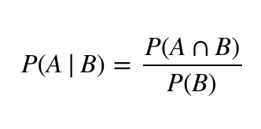
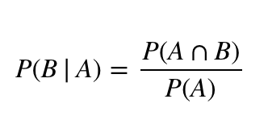
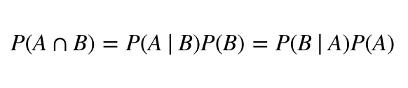
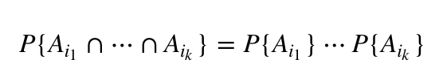
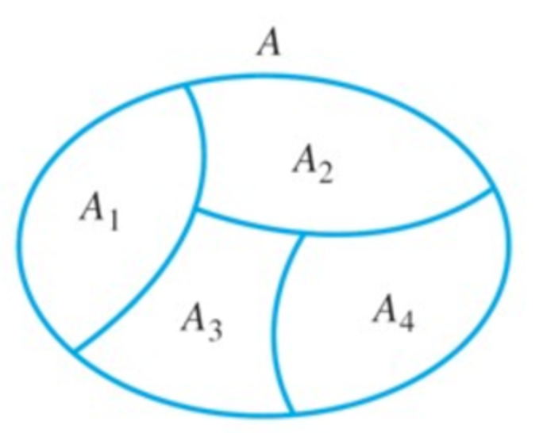
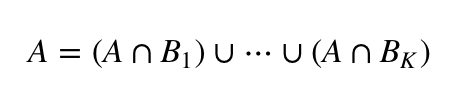
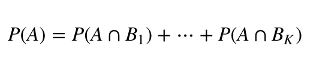
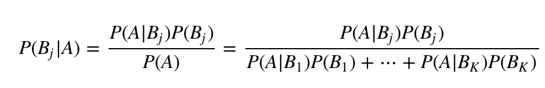

Conditional Probability(조건부 확률)
---------------

- P(A|B) : B가 일어나고나서 A가 일어날 확률, P(B)>0 로 가정 

- P(B|A) : A가 일어나고나서 B가 일어날 확률, P(A)>0 로 가정

위의 두 식을 이용하면,

Independence(독립)
----------------
- 두 사건이 서로 독립이라면 다음 식이 성립한다.

> P(A∩B)=P(A)P(B)
 
- 이를 사건이 n개가 있는 경우로 확장시키면,
어떠한 1≤i1<⋯<ik≤n에 대해서도 다음 식을 만족시킨다면 사건 A1,⋯,An를 독립인 사건이라고 한다.

- i1,⋯,ik라는 숫자는 1에서 n까지의 숫자중 임의의 k개(n개 이하)를 뽑은 인덱스, 즉 n개의 사건 중 아무거나 k개 뽑아서 교집합한 확률이 각각 확률의 곱과 같다면 독립이라고 할 수 있다.
 

Bayes’ Law(베이즈 정리)
--------------

> 분할(Partition)
- K개의 집합 B1,⋯,BK가 어떤 집합 S의 분할이 되려면 두 조건을 만족해야 한다.
 1. B1,⋯,BK  는 각각 서로소, 집합이 서로소 라는 것은 무작위로 두개를 뽑았을 때 겹치는 부분이 없어야 한다는 뜻
 2. K 개의  B1,⋯,BK를 합집합 하였을때 그 집합은 정확히 S가 되어야 한다. 
 
- 집합 A1,A2,A3,A4는 각각 서로 겹치는 부분이 없고 합집합을 했을 때  A가 되므로 이들은 A의 분할이라고 할 수 있다.

- K개의 집합 B1,⋯,BK 가 어떤 사건 S의 분할이라고 하면, 모든 S의 부분집합 A에 대해서 다음과 같은 식이 성립하게 된다. 

 
- 괄호안의 사건들이 각각 서로소이기 때문에 사건 A가 일어날 확률은 아래의 식과 같이 계산 가능

 
- 따라서 어떤 A라는 사건이 일어났을때, Bj라는 사건이 일어날 조건부 확률은 다음과 같이 계산 가능

- 통계학에서는 매우 중요한 의미를 가지고 있는 식이며 베이지안 통계학(Bayesian Statistics)라는 응용 통계학의 분야도 따로 있다. 또 머신러닝등 다양한 다른분야에서도 활발하게 활용되고 있다.

> Key Point

- 사건 A가 일어났을 때의 확률 P(Bj|A)를 계산함에 있어서 이를 거꾸로 뒤집어 B가 일어났을때의 확률들 P(A|Bi) 들로 표현 할 수 있다는 것
- 즉 A가 조건으로 주어졌을 때 B의 확률에 대해서 궁금했던 것을 반대로 B가 조건으로 주어졌을 때 A의 확률에 대해서 이야기 하는 것으로 바꾸어 쓸 수 있다는 것

Bayes' Law 예제
-------------
> 문제
- 어떤 주식이 그날 상승할 확률 : x
- 일별 주가 데이터 분석을 통해 x값이 0.4일 확률이 50%이고 0.6일 확률이 50%임을 발견 -> P(x=0.4)=0.5, P(x=0.6)=0.5
 
- 또 다른 데이터 관측을 통해 x값이 결정된 이후 주가가 3일연속 상승할 확률이 x^3으로 주어짐을 알아냄(여기서 서로 다른 날의 주가의 상승과 하락은 독립적이라고 가정), 그렇다면 주가가 3일연속 상승하였을 때 x값이 0.6인 확률은?

> 답안
- 문제를 쉽게 풀기 위해 주가가 3일연속 오른 사건을 A라고 함, 그러면 우리가 구해야 되는 확률은 P(x=0.6|A)가 되고 이를 베이즈 정리를 통해 나타내면 그 값을 다음과 같이 계산 할 수 있다.

P(x=0.6|A)=P(A|x=0.6)P(x=0.6)/P(A|x=0.6)P(x=0.6)+P(A|x=0.4)P(x=0.4)
 
=(0.6)^3(0.5)/{(0.6)^3(0.5)+(0.4)^3(0.5)}=0.7714

Prior Probability & Posterior Probability
-----------------
- 사전확률(prior probability) : 현재 가지고 있는 정보를 기초로하여 정한 초기확률 또는 확률 시행 전에 이미 가지고 있는 지식을 통해 부여한 확률
위의 문제에서는 x값이 0.4일 확률이 50%이고 0.6일 확률이 50% 라는 사실이 사전확률에 해당

- 사후확률(posterior probability) : 사건 발생 후에 어떤 원인으로부터 일어난 것이라고 생각되어지는 확률 또는 추가된 정보로부터 사전정보를 새롭게 수정한 확률
사후확률은 위의 문제에서와 같이 조건부 확률을 통해 표현 할 수 있다. 베이즈 정리를 통해 구한 0.7714 라는 수치가 이 문제에서 사후확률에 해당

- 이처럼 베이즈 정리는 새로운 정보에 대해 어떻게 대응하여 결과를 도출 해낼지를 알려주는 강력한 도구가 되기 때문에 매우 중요

참고 자료
-------- 
- https://junpyopark.github.io/bayes/#%EC%A1%B0%EA%B1%B4%EB%B6%80-%ED%99%95%EB%A5%A0(Conditional-Probability)
- https://namu.wiki/w/%EB%B2%A0%EC%9D%B4%EC%A6%88%20%EC%A0%95%EB%A6%AC
